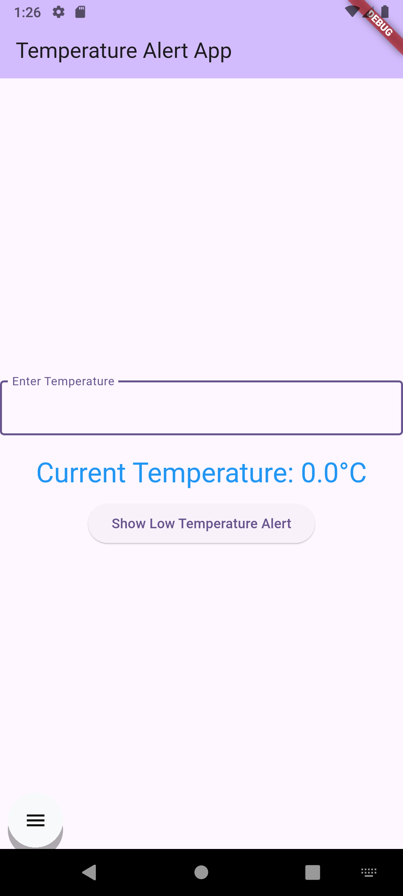
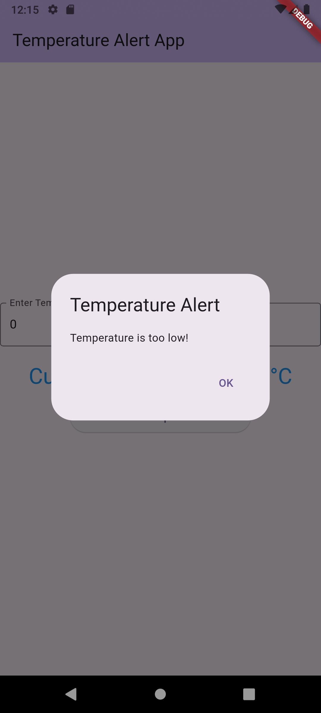

# Temperature Alert Flutter App

This Flutter application allows users to input a temperature and provides visual feedback and alerts based on predefined high and low thresholds.

## Features

- **Temperature Input**: Enter temperature values using a numerical input field.
- **Dynamic Text Color**: The displayed temperature text changes color based on thresholds:
  - **Red**: If the temperature is above the high threshold (30°C).
  - **Blue**: If the temperature is below the low threshold (10°C).
  - **Black**: If the temperature is within the normal range.
- **Alert Dialogs**: Buttons appear when the temperature exceeds a threshold, allowing the user to trigger an alert dialog.

## Screenshots

### 1. Initial State

This screenshot shows the app upon launch, with the temperature input field and the default temperature display.

| Initial State |
| :---: |
|  |

### 2. High Temperature Alert

This screenshot demonstrates the app when the entered temperature is above the high threshold. The temperature text should be red, and the "Show High Temperature Alert" button should be visible.

| High Temperature Alert |
| :---: |
|  |

### 3. Low Temperature Alert

This screenshot demonstrates the app when the entered temperature is below the low threshold. The temperature text should be blue, and the "Show Low Temperature Alert" button should be visible.

| Low Temperature Alert |
| :---: |
|  |

### 4. Alert Dialog Example

This screenshot shows an example of the alert dialog that appears when the "Show High Temperature Alert" or "Show Low Temperature Alert" button is pressed.

| Alert Dialog Example |
| :---: |
|  |

## How to Run

1. Clone this repository:
   ```bash
   git clone <repository_url>
   ```
2. Navigate to the project directory:
   ```bash
   cd temparature_alert
   ```
3. Get Flutter dependencies:
   ```bash
   flutter pub get
   ```
4. Run the app:
   ```bash
   flutter run
   ```

## Project Structure

```
.gitignore
.metadata
README.md
analysis_options.yaml
android\
├── app\
│   ├── build.gradle.kts
│   └── src\
├── build.gradle.kts
├── gradle\
│   └── wrapper\
├── gradle.properties
└── settings.gradle.kts
lib\
└── main.dart
pubspec.lock
pubspec.yaml
test\
└── widget_test.dart
web\
├── favicon.png
├── icons\
│   ├── Icon-192.png
│   ├── Icon-512.png
│   ├── Icon-maskable-192.png
│   └── Icon-maskable-512.png
├── index.html
└── manifest.json
```

## Dependencies

- Flutter SDK

## Contributing

Feel free to contribute to this project by submitting issues or pull requests.
